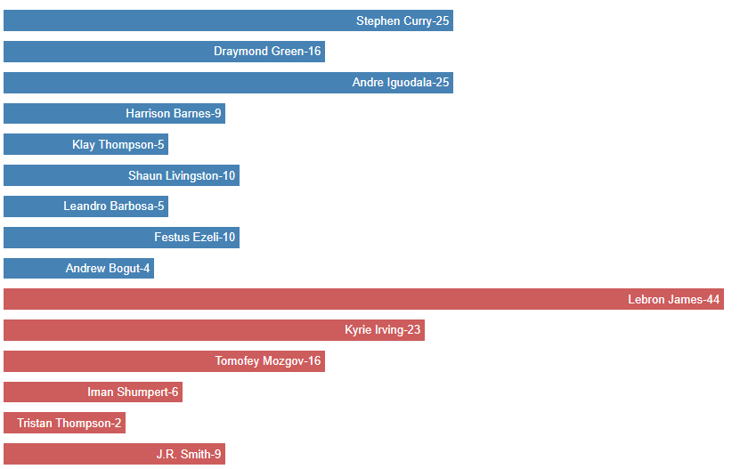
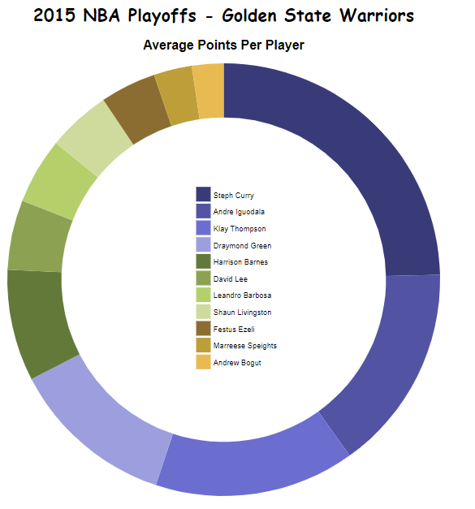
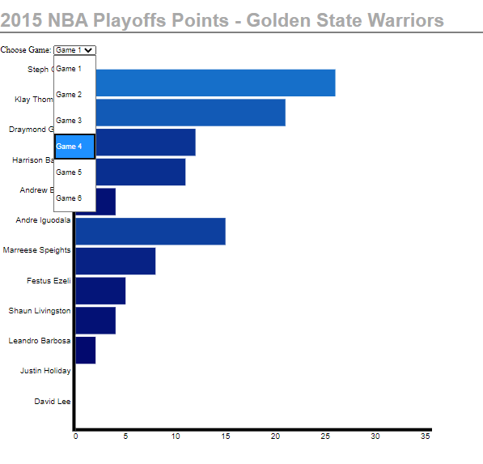

# gswProjectD3

In this project I was experimenting with creating some basic bar and donut charts with D3.
Some of the examples
I hacked together from other works.

The first example is a basic bar chart.

The second example is a donut chart that displays
more data when hovering over a part of the donut.

The third example is another bar chart where a user can
 change the data and see the scores for other games.
 
 

# How to install

In order to run this project on your computer Node.js and http-server must be installed in the project directory. Once installed, run http-server and navigate to localhost:8080 in your web browser.
